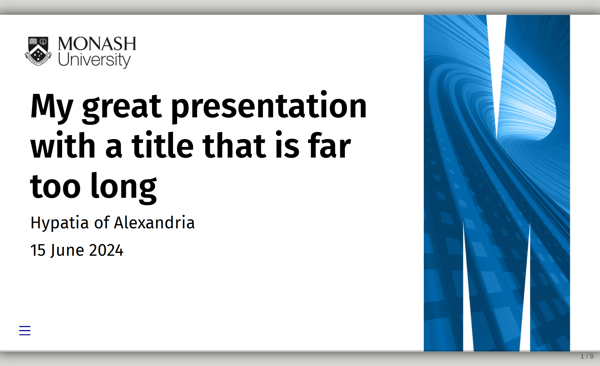

<!-- README.md is generated from README.qmd. Please edit that file -->

# Monash Presentation Templates

Monash-themed Beamer and RevealJS presentations

This is a Quarto template that assists you in creating a presentation
using Monash University theming.

## Creating a new presentation

You can use this as a template to create a presentation. To do this, use
the following command:

``` bash
quarto use template quarto-monash/presentation
```

This will install the extension and create an example qmd file that you
can use as a starting place for your presentation.

## Installation for existing document

You may also use this format with an existing Quarto project or
document. From the quarto project or document directory, run the
following command to install this format:

``` bash
quarto install extension quarto-monash/presentation
```

## Example

### Beamer output

[](examples/template.pdf)

## RevealJS output

[](examples/template.html)
